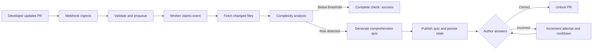
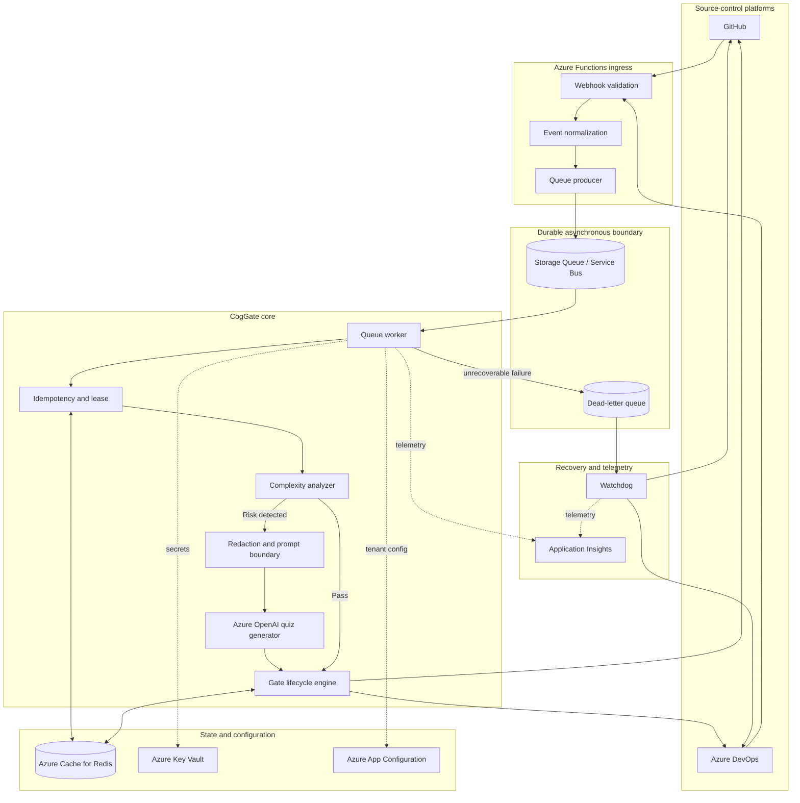
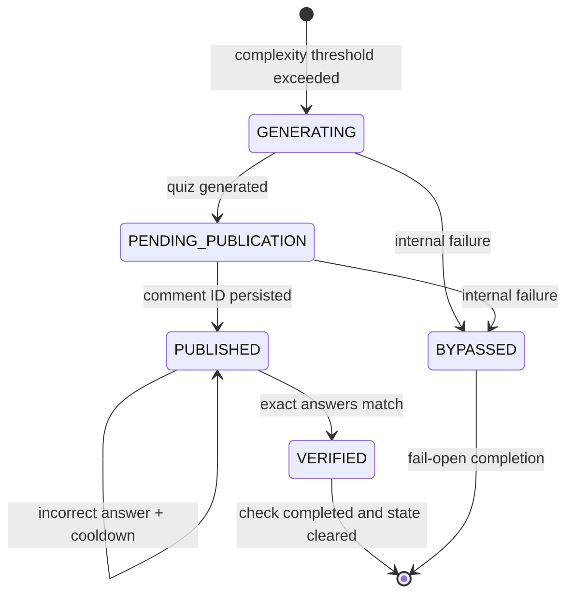
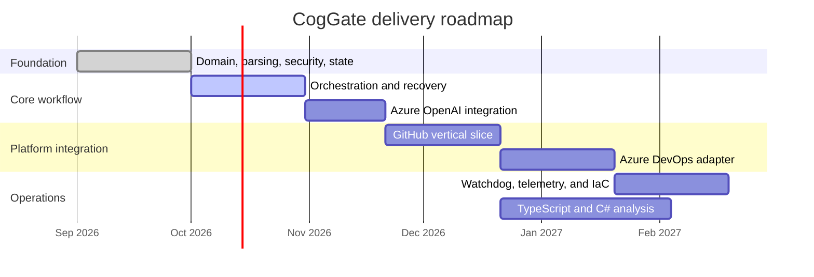

<div align="center">

# 🧠 CogGate

### The pull-request gate that checks understanding—not just syntax.

CogGate detects meaningful complexity introduced by a pull request and asks the
author a short, architecture-focused comprehension quiz before allowing the
change to merge.

[](https://www.python.org/)
[](https://azure.microsoft.com/products/functions/)
[](https://docs.pydantic.dev/)
[](LICENSE)
[](#project-status)

[How it works](#how-it-works) •
[Architecture](#architecture) •
[Get started](#local-development) •
[Roadmap](#roadmap) •
[Contributing](#contributing)

</div>

---

## Why CogGate?

AI can generate code faster than people can develop a mental model of it.
Traditional CI answers questions such as:

- Does it compile?
- Do the tests pass?
- Does it satisfy formatting and linting rules?

Those checks matter, but they cannot answer the human question:

> **Does the author understand the state changes, failure paths, concurrency
> risks, and downstream consequences of this change?**

CogGate is designed to close that gap. It does not quiz every pull request and
it does not ask trivia about variable names. It analyzes structural complexity
and, only when warranted, asks one to three questions about the behavior that
matters in production.

## How it works

In simple terms:

1. A pull request is opened or updated.
2. CogGate fetches the changed files and compares old and new function
   complexity.
3. Low-risk changes pass immediately.
4. Higher-risk changes produce a short comprehension quiz focused on side
   effects, error boundaries, state mutation, and downstream impact.
5. The PR author answers with a strict command such as:

   ```text
   /coggate answer q1=B q2=A
   ```

6. Correct answers complete the check. Incorrect answers increment an atomic
   attempt counter and start a cooldown.
7. If CogGate itself fails, its recovery path is designed to fail open rather
   than strand a critical pull request.



## What makes it different?

| Capability | CogGate approach |
|---|---|
| Selective gating | Quizzes are triggered by complexity deltas, not every code change. |
| Anti-cheat questions | Questions target consequences and failure modes rather than syntax. |
| Commit binding | Quiz state is tied to the active head SHA so stale answers cannot unlock newer code. |
| Multi-tenant isolation | State keys include platform, tenant, repository, PR, and commit identity. |
| Concurrency safety | Redis leases and Lua scripts protect event claims, attempts, cooldowns, and state transitions. |
| Prompt-injection defense | Source code is redacted, bounded, and wrapped as explicitly untrusted input. |
| Fail-open recovery | Platform failures are intended to flow to durable retry and watchdog recovery paths. |
| Platform portability | Core logic is isolated from GitHub and Azure DevOps through adapter contracts. |

## Architecture

CogGate follows a **ports-and-adapters** architecture. Platform APIs and Azure
infrastructure stay outside the core decision-making logic, allowing the
analyzer, state machine, and quiz lifecycle to be tested independently.



### Quiz lifecycle

Quiz publication uses explicit phases so that retries can distinguish generation
from publication and avoid silently producing inconsistent state.



## Core safety principles

### The code diff is untrusted

Code comments and strings can contain instructions intended to manipulate an
LLM. CogGate redacts common secret formats, enforces a deterministic input
limit, and encloses source text inside an `<untrusted_code_diff>` boundary.

### State changes are atomic

Redis Lua operations ensure that:

- only the lease owner can renew or release a lease;
- quiz state and its active-SHA pointer are saved together;
- failed attempts and cooldown activation happen together;
- clearing an old quiz cannot remove the pointer for a newer commit.

### Answer commands are exact

Embedded commands, duplicate question IDs, unsupported options, trailing prose,
and malformed input are rejected. Only the PR author will be permitted to
answer once the orchestration layer is connected.

### The gate must not become the outage

The target production design uses guarded fail-open completion. If that recovery
also fails, the event must remain visible to durable retries and a watchdog
instead of being swallowed as a successful execution.

## Project status

> [!IMPORTANT]
> CogGate is under active development and is **not yet a deployable,
> production-ready GitHub or Azure DevOps application**.

### Implemented today

- Strict Pydantic v2 domain contracts and phase invariants
- GitHub and Azure DevOps context models
- Exact `/coggate answer` grammar
- Python cognitive-complexity delta analysis
- Production/test/generated-file exclusions
- Secret redaction and bounded untrusted-diff prompts
- Generated Markdown link and mention neutralization
- Redis event claims, owned leases, active-SHA pointers, quiz state, cooldowns,
  and atomic failed-attempt handling
- Unit tests and strict mypy configuration

### Still being built

- Orchestration engine and lease heartbeat
- Two-phase platform publication and SHA-race recovery
- Azure OpenAI structured quiz generation
- GitHub App adapter and webhook ingestion
- Azure DevOps adapter and service-hook ingestion
- Queue worker, DLQ, and watchdog Azure Functions
- Tenant configuration through App Configuration and Key Vault
- Infrastructure-as-code and deployment workflows
- TypeScript and C# analyzers

## Local development

### Prerequisites

- Python 3.11 or newer
- Git
- PowerShell, Bash, or another terminal

Azure credentials, Redis, and platform tokens are **not required** for the
current core test suite.

### Setup

```bash
git clone https://github.com/is-goutham/coggate.git
cd coggate
python -m venv .venv
```

Activate the environment:

```powershell
# Windows PowerShell
.\.venv\Scripts\Activate.ps1
```

```bash
# macOS/Linux
source .venv/bin/activate
```

Install development dependencies and run the checks:

```bash
python -m pip install -r requirements-dev.txt
python -m pytest
python -m mypy function_app.py src tests
```

## Repository layout

```text
coggate/
├── function_app.py              # Azure Functions application entry point
├── src/
│   └── core/
│       ├── ast_analyzer.py      # Python cognitive-complexity delta analysis
│       ├── domain.py            # Strict events, contexts, quizzes, and ports
│       ├── parser.py            # Exact answer-command parser
│       ├── security.py          # Redaction, bounds, and output sanitization
│       └── state_manager.py     # Redis concurrency and quiz state
├── tests/                       # Focused unit tests
├── CONTRIBUTING.md              # Development and pull-request guidance
└── pyproject.toml               # Package, pytest, and mypy configuration
```

## Roadmap



Roadmap dates communicate sequencing rather than release commitments. Track
actual work through [GitHub issues](https://github.com/is-goutham/coggate/issues).

## Contributing

Contributions are welcome, especially around:

- cognitive-complexity accuracy and language support;
- Redis concurrency and recovery behavior;
- GitHub and Azure DevOps API adapters;
- adversarial prompt and secret-redaction test cases;
- Azure deployment, observability, and reliability.

Read [CONTRIBUTING.md](CONTRIBUTING.md) before opening a pull request. The short
version:

1. Open or reference an issue for non-trivial work.
2. Keep platform code outside `src/core`.
3. Add tests for every behavior change and failure path.
4. Run pytest and strict mypy locally.
5. Never commit credentials, tokens, private keys, or real customer code.

## Security

Do not report suspected vulnerabilities in a public issue. Use GitHub's
**private vulnerability reporting** feature for this repository when available,
or contact the maintainer privately.

Never include production secrets or proprietary source code in bug reports,
fixtures, screenshots, or pull requests.

## License

CogGate is available under the [MIT License](LICENSE).

---

<div align="center">

**Fast code is valuable. Understood code is safer.**

</div>
